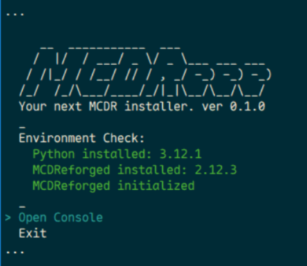

[`中文`](README_cn.md) | **English**

# MCDReee

Your next MCDReforged installer.

This project is a whim in my Rust learning. Well, it works on my machine.

## Features
- Install Python and MCDReforged
- Initialize / upgrade MCDReforged
- Generate start script for MCDReforged
- Install / upgrade PyPI modules

## Usage

Download and run `MCDReee.exe`.

## TODO

- [ ] Show main menu again when perform finished
- [x] i18n
